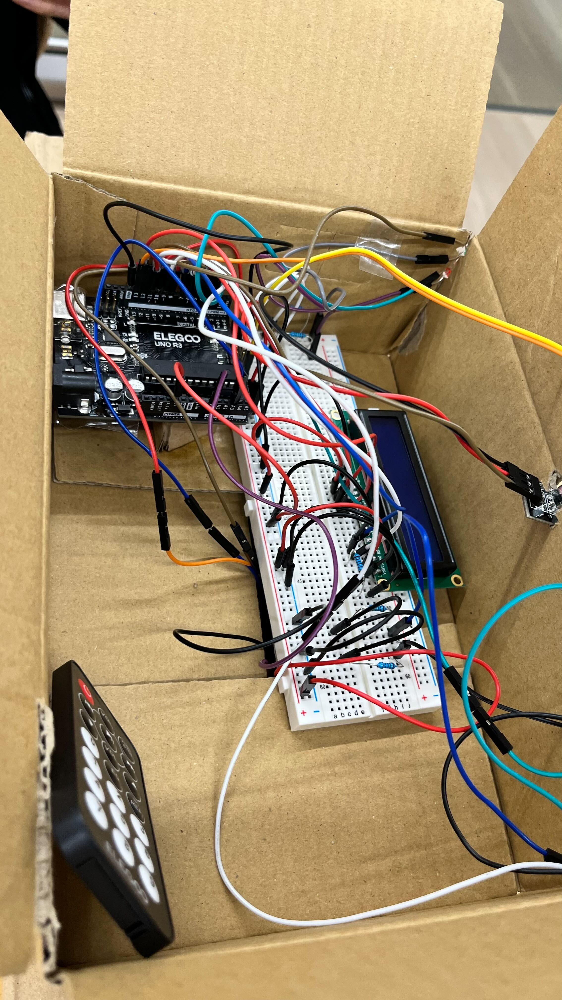
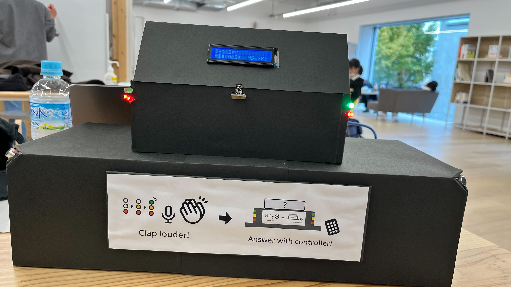
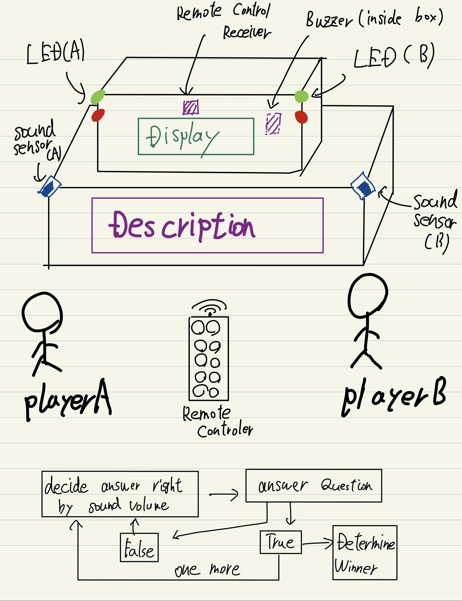

# QUICK BUZZ

## about
**Quiz game as a communication tool using the body**

We have an idea to strengthen the effect of playing quizzes as a tool that anyone can easily participate in, while at the same time engaging in physical activity.

The quiz is played on a one-on-one basis. The one whose volume reading from the microphone exceeds the specified value due to clapping or shouting will be given the right to answer.

The act of moving one's body relieves tension. Also, the loud sound it produces will soften the atmosphere of the place.

### data integration
Data is acquired by remote control signals and by the microphone module.
The signal from the remote control waits for acquisition based on the mode of the quiz. It is used to progress it and to input answers.
Also, data from the microphone module is acquired at regular intervals in terms of sound volume, which is used for mode progression and as a condition for turning on the lights.

### electronics board

### overall prototype
- **Photo**

- drawing

